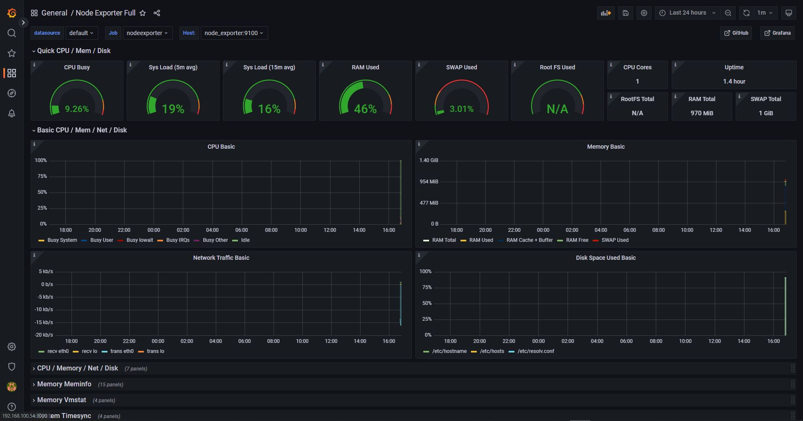

<p style="text-align: center; padding: 20px 0px;">

</p>

# System Monitoring



## - How To Running (Linux)

```
git clone https://github.com/saddam-satria/monitoring-dashboard.git

chmod +x run.sh

bash run.sh or ./run.sh

```

## - How To Running (Windows)

```
git clone https://github.com/saddam-satria/monitoring-dashboard.git

docker-compose -f container.yaml up -d
```

## - Configure Prometheus

when you have to reconfig prometheus, you can change it in prometheus folder, the config file connects as docker volume

## - Running Port

> Grafana => 3000

> Prometheus => 9090

> Node Exporter => 9100

<br>

<h3> made with ❤️ by Saddam Satria </h3>
<div style="padding: 10px 0px"> 
    <a href="https://www.linkedin.com/in/saddam-satria-ardhi-837570170/"></a>
    <a href="https://www.instagram.com/saddamsatria_12/"></a>
</div>
